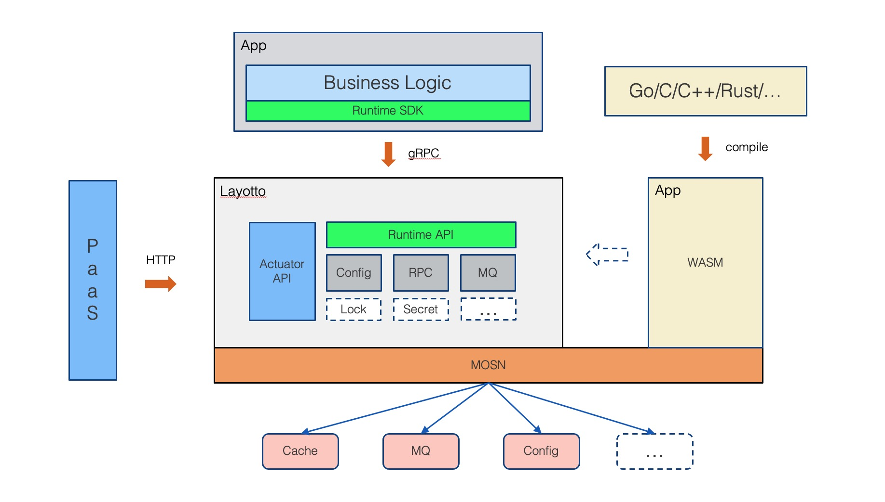

# Layotto (L8):To be the next layer of OSI layer 7
[English Version](README.md)

Layotto 是一款使用 Golang 开发的应用运行时, 旨在帮助开发人员快速构建云原生应用，帮助应用和基础设施解耦。它为应用提供了各种分布式能力，比如状态管理，配置管理，事件驱动等能力，以简化应用的开发。

Layotto 以开源的 [MOSN](https://github.com/mosn/mosn) 为底座，在提供分布式能力以外，提供了 Service Mesh 对于流量的管控能力。

## 功能

- 数据流量的劫持和观测
- 服务的限流能力
- 配置中心读写监听

## 工程架构

如下图架构图所示，Layotto 以开源 MOSN 作为底座，在提供了网络层管理能力的同时提供了分布式能力，业务可以通过轻量级的 SDK 直接与 Layotto 进行交互，而无需关注后端的具体的基础设施。

Layotto 提供了多种语言版本的 SDK，SDK 通过 gRPC 与 Layotto 进行交互，应用开发者只需要通过 Layotto 提供的配置文件[配置文件](./configs/runtime_config.json)来指定自己基础设施类型，而不需要进行任何编码的更改，大大提高了程序的可移植性。

## 快速开始

### 使用配置中心API

[通过 Layotto 调用 apollo 配置中心](docs/zh/start/configuration/start-apollo.md) 

[通过 Layotto 调用 etcd 配置中心](docs/zh/start/configuration/start.md)

### 使用Pub/Sub API实现发布/订阅模式

[通过Layotto调用redis，进行消息发布/订阅](docs/zh/start/pubsub/start.md)

### 在四层网络进行流量干预

[Dump TCP 流量](docs/zh/start/network_filter/tcpcopy.md)

### 在七层网络进行流量干预

[方法级别限流](docs/zh/start/stream_filter/flow_control.md)

### 进行RPC调用

[Hello World](docs/zh/start/rpc/helloworld.md)

[Dubbo JSON RPC](docs/zh/start/rpc/dubbo_json_rpc.md)

### 健康检查、查询运行时元数据

[使用 Layotto Actuator 进行健康检查和元数据查询](docs/zh/start/actuator/start.md)

## 如何贡献代码

请参阅[贡献者指南](CONTRIBUTING_ZH.md)。

## 社区

使用 [钉钉](https://www.dingtalk.com/) 扫描下面的二维码加入 Layotto 用户交流群。

或者通过钉钉搜索群号 31912621，加入用户交流群。

