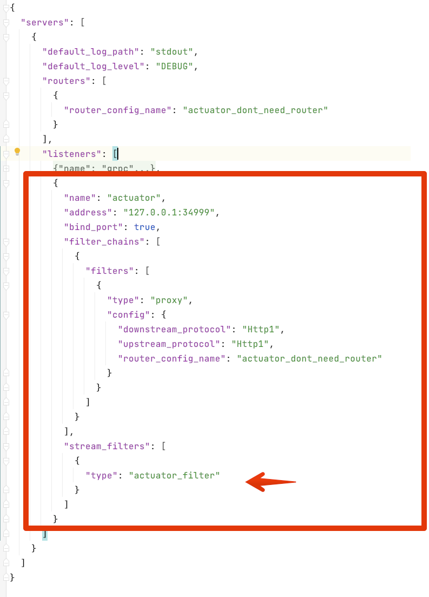
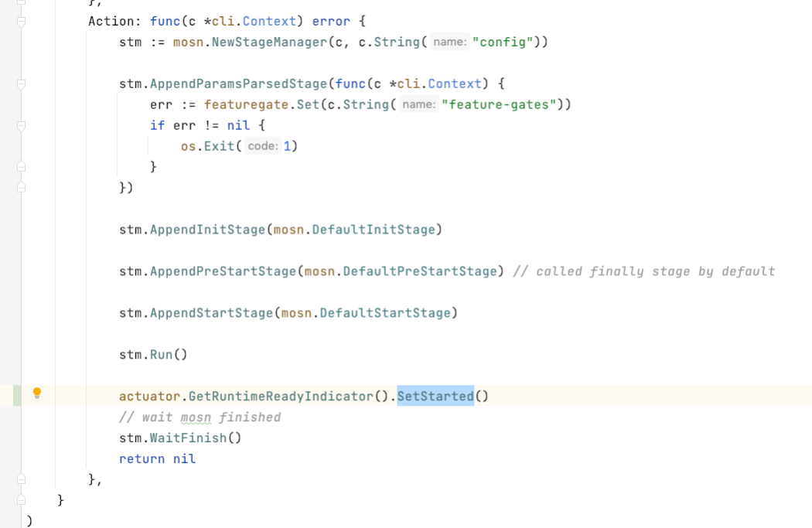

# Actuator's Design Document
# 1. Product Design
## 1.1. Requirements

- Health check

Users can check the health status of both LayOtto internal components and the applications behind LayOtto through the Actuator API,

- Query runtime metadata

Through the Actuator API, LayOtto's own metadata information (such as version, git information) and metadata information of business applications can be obtained (such as the list of subscribed topics, such as application version information)

- Support integration into open source infrastructure, including:
    - Can be integrated into k8s health check
    - Can be integrated into a monitoring system, such as Prometheus+Grafana
    - If necessary, the service registry can remove nodes based on the health check results
    - We can build dashboard projects or GUI tools based on this API in the future to troubleshoot problems.

- Similar to the functions of Spring Boot Actuator, there will be more room for imagination in the future: Monitoring, Metrics, Auditing, and more.

## 1.2. Explanation

**Q: What is the value? People use the health check API for what?**

1. For troubleshooting.Developers can access the Actuator API directly to query runtime metadata or reasons for unavailability, or using a dashboard page/GUI tool based on the API.

2. For monitoring by the monitoring system;

3. For automated operation provided by the infrastructure.For example,the deployment system can use the health check results to determine the deployment progress, whether should it continue or not; the service registry can remove abnormal nodes based on health checks;the k8s can kill and recreate containers based on health checks.


**Q: It seems that there is no need to return detailed information,since a status code is enough? Who will use the detailed runtime information?**

1. We can build a dashboard page or GUI tool based on the detailed information in the future to troubleshoot problems;

Similar to the spring boot community wrote a 'spring boot admin' web page based on the spring boot actuator

2. With these information,we can integrate LayOtto into monitoring system like Prometheus+Grafana

Similar to Spring Boot Actuator being integrated with Prometheus+Grafana

**Q: Should we add some admin API to control the ability, such as "turn off the ability of specific components inside LayOtto"**

A: Don't do it. Switching some components off will leave the app in a partial failure state, which can lead to uncertainty.
However, we can consider adding debug capabilities in the future, such as mock, packet capture and package modification, etc.


**Q: Does the health check API do permission control?**

A: Don't do it for now, add a hook if we receive feedbacks in the future.


# 2. High-level design

## 2.1. Overview

Develop the http API first, because the health check function of the open source infrastructure basically supports http (such as k8s, prometheus), while grpc is not supported.

In order to reuse filter capabilities such as the authentication filter of MOSN, Actuator runs on MOSN using a layer-7 filter as a glue layer.

Specifically, add a new listener and a new stream_filter to MOSN. This filter is responsible for http request processing and calling Actuator.

Endpoint is an abstract inside Actuator. After a new request arrives at the server, Actuator will entrust the corresponding Endpoint to process it. Endpoint supports on-demand expansion and injection into Actuator:


## 2.2. Http API design

### 2.2.1. Explanation for API path

The path adopts restful style. After different Endpoints are registered in Actuator, the path is:

```
/actuator/{endpoint_name}/{params}
```

For example: 
```
/actuator/health/liveness
```

The 'health' element in the path above identifies the Endpoint name is health, and 'liveness' is the parameter passed to the health Endpoint.

Multiple parameters can be passed, such as /actuator/xxxendpoint/a/b/c/d, and the semantics of the parameters are determined by each Endpoint.


The paths registered by default are:

```
/actuator/health/liveness

/actuator/health/readiness

/actuator/info
```

### 2.2.2. Health Endpoint
#### /actuator/health/liveness
GET
```json
// http://localhost:8080/actuator/health/liveness
// HTTP/1.1 200 OK

{
  "status": "UP",
  "components": {
    "livenessProbe": {
      "status": "UP",
      "details":{
				 
      }
    }
  }
}
```
Return field description:

HTTP status code 200 means success, other (status code above 400) means failure.

There are three types of status fields:
```go
var (
	// INIT means it is starting
	INIT = Status("INIT")
	// UP means it is healthy
	UP   = Status("UP")
	// DOWN means it is unhealthy
	DOWN = Status("DOWN")
)
```

#### /actuator/health/readiness
GET
```json
// http://localhost:8080/actuator/health/readiness
// HTTP/1.1 503 SERVICE UNAVAILABLE

{
  "status": "DOWN",
  "components": {
    "readinessProbe": {
      "status": "DOWN"
    }
  }
}
```
### 2.2.3. Info Endpoint

#### /actuator/info

GET
```json
// http://localhost:8080/actuator/health/liveness
// HTTP/1.1 200 OK

{
    "app" : {
        "version" : "1.0.0",
        "name" : "LayOtto"
    }
}
```

**Q: What are the runtime metadata requirements?**

Phase 1:

- version number

We can add more information in the future:

- Callback app
- Runtime configuration parameters


**Q: Is it mandatory for components to implement the health check API?**

Temporarily not mandatory

## 2.3. Schema of config data



A new listener is added for handling actuator requests. A new stream_filter called actuator_filter is added for http request processing(see below)

## 2.4. Internal structure and request processing flow


explanation£º

### 2.4.1. When requests arrive

The request arrives at the mosn, enters LayOtto through the stream filter, and calls the Actuator.

The http protocol implementation class (struct) of the stream filter layer is DispatchFilter, which is responsible for dispatching requests and calling Actuator according to the http path:
```go

type DispatchFilter struct {
	handler api.StreamReceiverFilterHandler
}

func (dis *DispatchFilter) SetReceiveFilterHandler(handler api.StreamReceiverFilterHandler) {
	dis.handler = handler
}

func (dis *DispatchFilter) OnDestroy() {}

func (dis *DispatchFilter) OnReceive(ctx context.Context, headers api.HeaderMap, buf buffer.IoBuffer, trailers api.HeaderMap) api.StreamFilterStatus {
}
```
The protocol layer is decoupled from Actuator. If the API of other protocols is needed in the future, the stream filter of this protocol can be implemented.

### 2.4.2. Requests will be assigned to Endpoints inside Actuator

Drawing lessons from the design of spring boot: Actuator abstracts the concept of Endpoint, which supports on-demand expansion and injection of Endpoint. 

Built-in Endpoints are health Endpoint and info Endpoint.
```go
type Actuator struct {
	endpointRegistry map[string]Endpoint
}

func (act *Actuator) GetEndpoint(name string) (endpoint Endpoint, ok bool) {
	e, ok := act.endpointRegistry[name]
	return e, ok
}

func (act *Actuator) AddEndpoint(name string, ep Endpoint) {
	act.endpointRegistry[name] = ep
}

```
When a new request arrives at Actuator,it will be assigned to the corresponding Endpoint according to the path. 

For example, /actuator/health/readiness will be assigned to health.Endpoint

### 2.4.3. health.Endpoint collect information from all the implementation of health.Indicator

The components that need to report health check information should implement the Indicator interface and inject it into health.Endpoint:
```go
type Indicator interface {
	Report() Health
}
```
When a new request arrives,health.Endpoint will collect information from all the implementation of health.Indicator

### 2.4.4. info.Endpoint collect information from all the implementation of info.Contributor

Components that need to report runtime information should implement the Contributor interface and inject it into info.Endpoint:
```go
type Contributor interface {
	GetInfo() (info interface{}, err error)
}
```

When the path '/actuator/info' is visited,Actuator dispatch the request to info.Endpoint.

info.Endpoint will collect information from all the implementation of info.Contributor

# Èý¡¢Detailed design

## 3.1. When will health state change
### 3.1.1. runtime_startup Indicator

- SetStarted



- SetUnhealthy 
  
When the startup fails:


When server stops:


### 3.1.2. apollo's Indicator

When failing in initializing the component:

