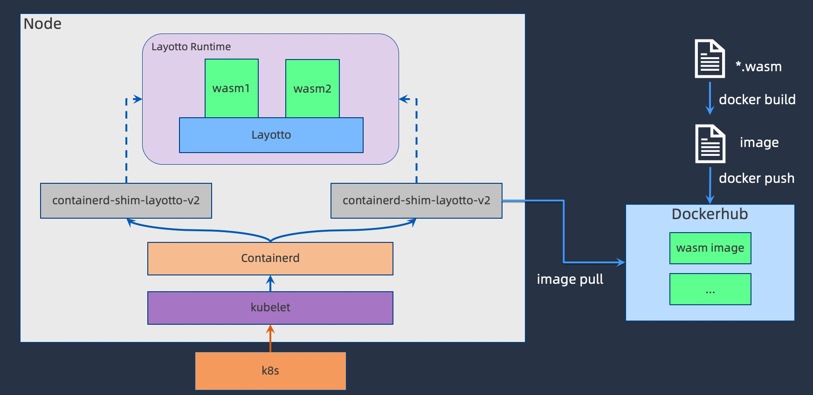

## FaaS design document

### 1. Architecture

Incorporating into the k8s life cycle management and scheduling strategy, the Containerd-shim-layotto-v2 plugin implements the v2 interface definition of Containerd, and changes the container runtime to Layotto Runtime. For example, the implementation of k8s creating a container is modified to load and run functions in form of wasm.

Thanks to the excellent sandbox isolation environment of WebAssembly, Layotto as a function base can load and run multiple wasm functions. Although they all run in the same process, they do not affect each other. Compared with docker, this idea of nanoprocess can make fuller use of resources.

### 2. Core components

#### A、Function

The wasm1 and wasm2 in the above figure respectively represent two functions. After the function is developed, it will be compiled into the form of `*.wasm` and loaded and run. It makes full use of the sandbox isolation environment provided by [WebAssembly(wasm)](https://webassembly.org/) to avoid mutual influence between multiple functions.

#### B、[Layotto](https://github.com/mosn/layotto)

The goal is to provide services, resources, and safety for the function. As the base of function runtime, it provides functions including WebAssembly runtime, access to infrastructure, maximum resource limit for functions, and system call permission verification for functions.

#### C、[Containerd](https://containerd.io/)

Officially supported container runtime, docker is currently the most widely used implementation. In addition, secure containers such as kata and gvisor also use this technology. Layotto also refers to their implementation ideas and integrates the process of loading and running functions into the container runtime.

#### D、[Containerd-shim-layotto-v2](https://github.com/layotto/containerd-wasm)

Based on the V2 interface definition of Containerd, the runtime logic of the container is customized. For example, the implementation of creating a container is modified to let Layotto load and run the wasm function.

#### E、[Kubernetes](https://kubernetes.io/)

The current container scheduling standards, life cycle management and scheduling strategies are excellent. Layotto chose to use the containerd in order to perfectly integrate the scheduling of functions with the k8s ecology.

### 3. Runtime ABI

#### A. [proxy-wasm-go-sdk](https://github.com/layotto/proxy-wasm-go-sdk)

On the basis of [proxy-wasm/spec](https://github.com/proxy-wasm/spec), refer to the definition of [Runtime API]( ../../../../spec/proto/runtime/v1/runtime.proto), add APIs for functions to access infrastructure.

#### B. [proxy-wasm-go-host](https://github.com/layotto/proxy-wasm-go-host)

It is used to implement the logic of Runtime ABI in Layotto.

