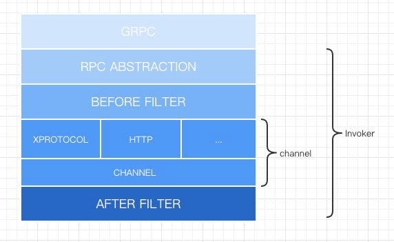

RPC DESIGN

### API
runtime rpc API is same with Dapr.

### Core Abstraction
in order to decoupling with pb definition，add independent RPC abstrations.

- invoker： provide complete rpc ability，currently only Mosn invoker
- callback：before/after filter，extend with custom logic(eg: protocol convertion)
- channel：send request and receive response, talk to diffrent transport protocol（http、bolt...)
  
due to Mosn do all the dirty work, a lightweight framework is enough for layotto currently.
  



### Mosn Integration

runtime rpc is a grpc handler based on Mosn grpc module, works on L7, Mosn's proxy ability and filter ability works on L4, they can't communicate with simple function calls.

in order to reuse Mosn's powerful proxy and filter ability, use brand new way to integrating with Mosn.

1. channel encode request to packet， L7 -> L4
2. create two in-memory fake connection(net.Pipe), local connection and remote connection, then let Mosn accept remote connection
3. layotto write to local connection, send data to Mosn
4. Mosn read from remote connection, do proxy and filter logic, then write response to remote connection
5. layotto read from local connection, get Mosn response


#### xprotocol extension
Mosn's xprotocol support popular protocols such as dubbo、thrift...

In layotto, we design a convenient way to support xprotocols. The only task need to be finished is convert RPC request and response to xprotocol frames.

#### config params
```bigquery
{
  "mosn": {
    "config": {
      "before_invoke": [{
        "name": "xxx" // filter before invoke
      }],
      "after_invoke": [{
        "name": "xxx" // filter after invoke
      }],
      "total_channels": 1, // analogy to connection nums
      "channel": {
        "protocol": "http", // communicate with mosn via this protocol
        "listener": "egress_runtime_http" // mosn's protocol listener name
      }
    }
  }
}
```