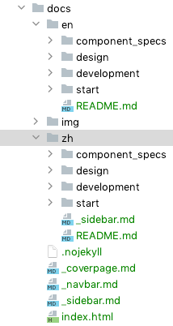
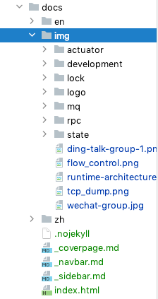

# Document Contribution Guide

Thanks for your support for Layotto！

This document describes how to modify/add documents. Documentation for this repository is written in Markdown.

## Document Path description

Documents are stored in the docs/ directory, within it, docs/en stores English documents and docs/zh stores Chinese documents.



## How to Add a New Document
To add a document, create a folder and a .md file based on the directory structure. For example, if you want to write a design document for the distributed lock API, just create a new directory:


2. Remember to update the sidebar after adding new documents or revising existing documents.

Chinese sidebar: docs/zh/_sidebar.md

English sidebar: docs/_sidebar.md

3. After finishing the above Markdown files, submitting pr and merging it into the main branch, new documents are now available on the official website.

## Documentation Site Description
Files under docs/ directory will be automatically deployed to github pages and rendered through [docsify](https://docsify.js.org/#/).

Generally speaking, after the .md file is merged into the main branch, you can see the new page on the Layotto's documentation site, and all deployment and rendering processes are down automatically.

## Common Pitfalls: Hyperlinks Within Documents

One annoying problem with Docsify is that the use of hyperlinks are confused.

The hyperlink mentioned here is the kind of links that will jump to other documents once clicked, such as the following:


### Incorrect Syntax
If you try to create a hyperlink with a relative path, then a 404 page will be popped out once you clicked on it:


### Correct Syntax

There are two suggested ways to use hyperlinks:

a. Use a path relative to the docs/ directory. Such as:


b. Use the full Url. Such as:

```markdown
see [runtime_config.json](https://github.com/mosn/layotto/blob/main/configs/runtime_config.json):
```

## Picture Catalog and Link
Images are stored under docs/img/ directory for the purpose that the Docsify site can access it



It is recommended to use the full path when referencing images in documents, to avoid a bunch of messy path problems.

For example, when referencing the images under the main branch, the prefix of the image Url is https://raw.githubusercontent.com/mosn/layotto/main/docs/img

Markdown：

```markdown

```

Note: Relative paths can also be used, but you may encounter problems like the logical path behind  tag and relative path is different, users access the README file through different paths, etc. It will be painful.