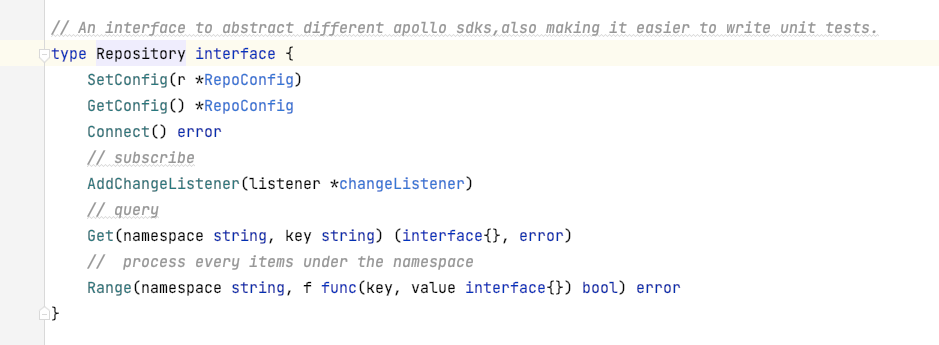
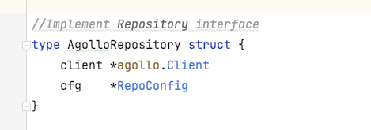
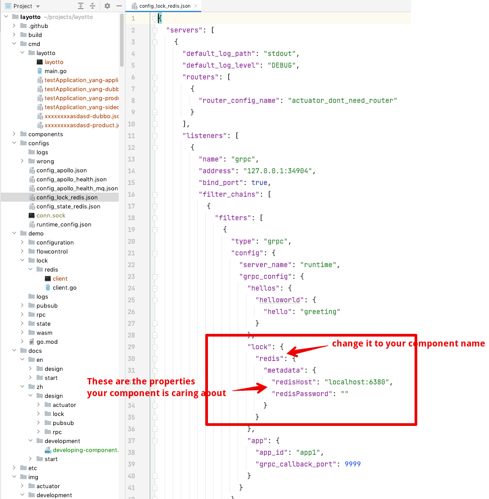
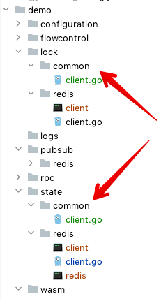
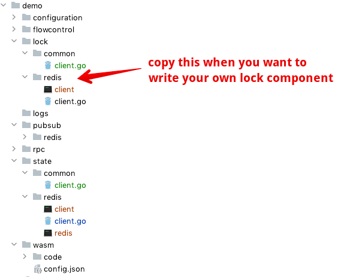
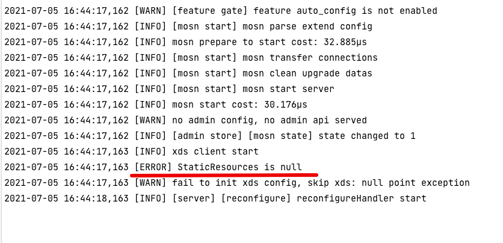

# Component Development Guide

Thank you for your support in Layotto!

This is a Layotto components development guide. Layotto components are written in Go. If you are unfamiliar with Go, check out here [Go tutorial](https://tour.golang.org/welcome/1).

When developing new components, you can refer to the existing components. For example, if you want to implement distributed lock API with ZooKeeper, you can refer to the realization of the redis, related demos, and design documents to make your development easier.
## 1、Preparation Work

1. Git clone the repository to your preferred directory
2. Use Docker to launch the environment you need. For example, if you want to develop a distributed lock API with ZooKeeper, you need to start a ZooKeeper container locally with Docker for local tests.
   If you do not have Docker locally, you can install a Docker Desktop by following [Docker Desktop tutorial](https://www.runoob.com/docker/windows-docker-install.html). Mac and Windows are both supported which is easy to use.
   
## 2、Development Components and Unit Tests
### 2.1.Create a new folder under Components/API directory to develop your components

The folder name can use the component name, referring to the redis component below


Tools you may use in the process of development (for the purpose of reference only, hope to simplify the development) :

- When staring a new goroutine, panic triggered in it may lead to a panic breakdown to the entire server. Therefore, it is common to start a goroutine with recover() inside deferred functions. You can also use the encapsulated utility classes, like utils.GoWithRecover in mosn.io/pkg/utils/goroutine.go

- log.DefaultLogger is a commonly used logging tool, and it is located in mosn.io/pkg/log/errorlog.go

- Others: There are utility classes under pkg/common and mosn.io/pkg directory

### 2.2. Copy and Paste Other Components

You can simply copy and paste other components for modification or development. For example, if you want to implement the distributed lock API using ZooKeeper, you can copy and paste the Redis component

### 2.3. Write Unit Tests!
#### 2.3.1. Unit testing tips
Unit tests will be run in various environments, including the docker provided by github action and other developers' computers. Thus, following problems need to be considered to run unit tests normally:
- Other people may not have ZooKeeper installed in their environments. So when we write a unit test, either mock out the network call code (for example, mock out the part of the ZooKeeper code in unit tests) or create a simplified ZooKeeper in the unit test (for example, in the Redis Unit test, A mini-redis will be created) to ensure others can pass the test.
- When someone commits code, it automatically runs unit tests, and and they will be merged only when they are all passed. Therefore, try to avoid sleeping too long in the unit test (sleeping too long can decrease the speed of unit tests)
#### 2.3.2. How to mock out dependencies in the environment when running unit tests? (Such as Mock ZooKeeper or Mock Redis)

It is usual to encapsulate all network call code into a single interface, and then mock out that interface in ut. Take the unit tests in Apollo configuration center as an example, referring to components/configstores/apollo/configstore.go. and
components/configstores/ apollo/configstore_test.go:

First, in configstore.go, encapsulate all calls to the SDK, network and Apollo into a single interface.




Then, encapsulate your code that calls the SDK and network into a struct which achieves that interface:



Once you've done this refactoring, your code is testable (this is part of the idea of test-driven development, refactoring code into a form that can be injectable in order to improve its testability)

Next, we can mock that interface when we write ut:


Just mock it into the struct you want to test, and test it.


Note: Generally, during "integration test", network call will be made and a normal ZooKeeper or Redis will be called. On contract, the single test focuses on the local logic, and will not call the real environment


## 3、Register components when Layotto starts
Following the steps above only develops the component which Layotto does not automatically load when it starts.

So how should let Layotto load the components at startup?

Need to integrate new components in cmd/layotto/main.go, including:

### 3.1. Import your components in main.go


### 3.2. Register your component in the NewRuntimeGrpcServer function of main.go


After that, Layotto initializes the ZooKeeper component if the user has configured "I want to use ZooKeeper" in the Layotto configuration file

## 4、Add demo for integration test
According to the above operations, the development is completed, but we need to get the process running and testing, so we need to add an integration test demo

### 4.1. Add a sample configuration file


As mentioned above:
>Layotto initializes the ZooKeeper component if the user has configured "I want to use ZooKeeper" in the Layotto configuration file

So how to configure when users want to use Zookeeper? We need to provide a sample configuration, for both user reference and running integration tests

We can copy a json configuration file from another component. For example, copy configs/config_lock_redis.json and paste it into configs/config_lock_zookeeper.json when developing a plug-in component
Then edit and modify the configuration shown below:




### 4.2. Add client Demo
We need a client demo, such as the distributed lock client demo that has two coroutines concurrently calling Layotto to grab the lock, and only one can grab the lock

#### a. If the component has a generic client, it doesn't need to be developed
If there is a common folder under demo directory, it means the demo is a general purpose demo, which can be used by different components. You can pass the storeName parameter on the command line, and you don't need to develop a demo if you have this



#### b. If the component does not have a generic client or requires custom metadata arguments, copy and paste them
For example, when implementing distributed locks using ZooKeeper, you need some custom configurations. Then you can write your demo based on the Redis demo



Note: If there are errors in the demo code that shouldn't be there , you can panic directly. Later, we will directly use demo to run the integration test. If panic occurs, it means that the integration test fails. For example the demo/lock/redis/client.go:
```go
    //....
  cli, err := client.NewClient()
  if err != nil {
    panic(err)
  }
    //....
```

### 4.3. Refer to the QuickStart documentation to start Layotto and Demo and see if any errors are reported
For example, refer to the [QuickStart documentation of the Distributed Lock API](zh/start/lock/start.md) , start your dependent environment (such as ZooKeeper), and start Layotto (remember to use the configuration file you just added!). And check for errors.

Note: The following Error is ok, just ignore it



Start demo and call Layotto to see if any errors are reported. If it is a universal client, you can pass storeName with -s storeName in the command line


If there is no error when running, it means the test passed!

## 5、New component description documents
When the above code work is completed , it is better to add the configuration documentation of the component, explaining what configuration items the component supports and how to start the environment that the component depends on (for example, how to start ZooKeeper with Docker).

You can refer to the [Redis component description of the Lock API (Chinese)](zh/component_specs/lock/redis.md) and [the Redis component description of the Lock API (English)](en/component_specs/lock/redis.md), also can copy and paste change.