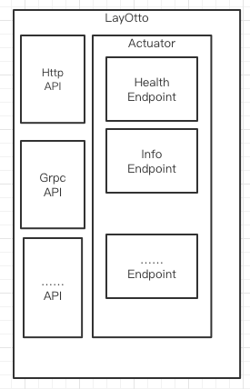
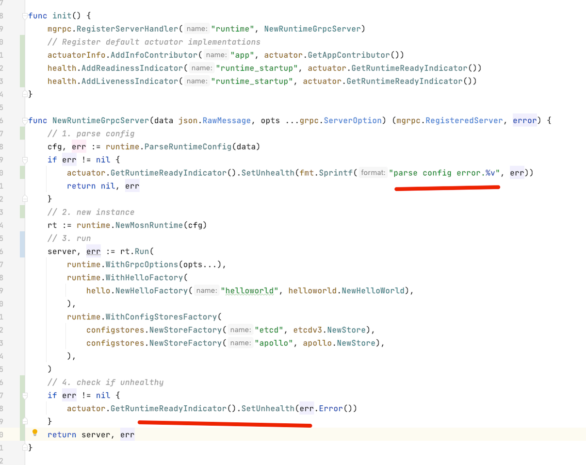
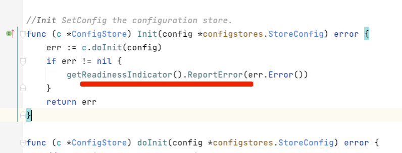

# Actuator设计文档
# 一、产品设计
## 1.1. 需求

- 健康检查

通过Actuator接口可以统一获取到LayOtto内部所有组件以及业务应用的健康状态

- 查看运行时元数据

通过Actuator接口可以统一获取到LayOtto自己的元数据信息（例如版本，git信息），以及业务应用的元数据信息（例如通过配置中心订阅的配置项列表，例如应用版本信息）

- 支持集成进开源基础设施，包括：
    - 可以集成进k8s健康检查
    - 可以集成进监控系统，比如Prometheus+Grafana
    - 如有需要，注册中心可以基于健康检查结果剔除节点
    - 后续可以基于此接口做dashboard项目或者GUI工具,以便排查问题。
    
- 类似于Spring Boot Actuator的功能，未来有更多的想象空间：Monitoring, Metrics, Auditing, and more.

## 1.2. 解释

**Q: 价值是啥？健康检查接口开出来给谁用？**

1. 供开发排查问题，直接调接口查询运行时信息，或者做个dashboard页面/GUI工具

2. 供监控系统做监控；

3. 供基础设施做自动化运维，比如部署系统基于健康检查来判断部署进度，停止或继续分批部署；比如注册中心基于健康检查剔除异常节点；比如k8s基于健康检查kill容器、重新创建容器


**Q: 好像返回个状态码就行，没必要返回运行时信息？查出来的运行时详细信息给谁用？**

1. 后续可以基于此接口做dashboard页面或者GUI工具,以便排查问题；

类似于spring boot社区基于spring boot actuator写了个spring boot admin网页
参考[https://segmentfault.com/a/1190000017816452](https://segmentfault.com/a/1190000017816452)

2. 集成监控系统:可以接入Prometheus+Grafana

类似于Spring Boot Actuator接入Prometheus+Grafana
参考[Spring-Boot-Metrics监控之Prometheus-Grafana](https://bigjar.github.io/2018/08/19/Spring-Boot-Metrics监控之Prometheus-Grafana/)


**Q: 做不做管控能力，比如“开关 LayOtto 内部特定组件的流量”**

A: 不做，开关部分组件会让app处于partial failure状态，有不确定性。
但是后续可以考虑添加debug能力，比如mock、抓包改包等


**Q: 健康检查的接口做不做权限管控**

A: 先不搞，有反馈需求再加个钩子


# 二、概要设计

## 2.1. 总体方案

先开放http接口，因为开源基础设施的健康检查功能基本上都支持http（比如k8s,prometheus)，没有支持grpc的。

为了能够复用MOSN的鉴权filter等filter能力，Actuator将作为7层的filter跑在MOSN上。

具体来说，MOSN新增listener,新写个stream_filter,这个filter负责http请求处理、调用Actuator.

Actuator内部抽象出Endpoint概念，新请求到达服务器后，Actuator会委托对应的Endpoint进行处理。Endpoint支持按需扩展、注入进Actuator：



## 2.2. Http API设计

### 2.2.1. 路径解释

路径采用restful风格，不同的Endpoint注册进Actuator后，路径是

```
/actuator/{endpoint_name}/{params}  
```

比如

```
/actuator/health/liveness
```

其中health标识Endpoint的名称是health，liveness是传给该Endpoint的参数。

参数支持传多个，形如 /a/b/c/d，具体传几个、参数的语义由每个Endpoint自己定


默认注册的路径有：

```
/actuator/health/liveness
/actuator/health/readiness
/actuator/info
```

### 2.2.2. Health Endpoint
#### /actuator/health/liveness

GET
```json
// http://localhost:8080/actuator/health/liveness
// HTTP/1.1 200 OK

{
  "status": "UP",
  "components": {
    "livenessProbe": {
      "status": "UP",
      "details":{
				 
      }
    }
  }
}
```
返回字段说明：
HTTP状态码200代表成功，其他(400以上的状态码)代表失败
status字段有三种：
```go
var (
	// INIT means it is starting
	INIT = Status("INIT")
	// UP means it is healthy
	UP   = Status("UP")
	// DOWN means it is unhealthy
	DOWN = Status("DOWN")
)
```

#### /actuator/health/readiness

GET
```json
// http://localhost:8080/actuator/health/readiness
// HTTP/1.1 503 SERVICE UNAVAILABLE

{
  "status": "DOWN",
  "components": {
    "readinessProbe": {
      "status": "DOWN"
    }
  }
}
```
### 2.2.3. Info Endpoint

#### /actuator/info

GET
```json
// http://localhost:8080/actuator/health/liveness
// HTTP/1.1 200 OK

{
    "app" : {
        "version" : "1.0.0",
        "name" : "LayOtto"
    }
}
```


**Q: 运行时元数据要哪些？**

一期：

- 版本号

后续可以加上：

- 回调app
- 运行时配置参数


**Q: 是否强制要求组件实现健康度检查接口？**

暂时不强制

## 2.3. 配置数据的数据模型


新增listener用于处理actuator，stream_filters新增actuator_filter，用于处理actuator的请求（见下）

## 2.4. 内部结构与请求处理流程


解释：

### 2.4.1. 请求到达mosn，通过stream filter进入LayOtto、调用Actuator

stream filter层的http协议实现类(struct)为DispatchFilter，负责按http路径分发请求、调用Actuator:
```go

type DispatchFilter struct {
	handler api.StreamReceiverFilterHandler
}

func (dis *DispatchFilter) SetReceiveFilterHandler(handler api.StreamReceiverFilterHandler) {
	dis.handler = handler
}

func (dis *DispatchFilter) OnDestroy() {}

func (dis *DispatchFilter) OnReceive(ctx context.Context, headers api.HeaderMap, buf buffer.IoBuffer, trailers api.HeaderMap) api.StreamFilterStatus {
}
```
协议层和Actuator解耦，如果未来需要其他协议的接口，可以实现该协议的stream filter

### 2.4.2. 请求分发给Actuator内部的Endpoint

参考spring boot actuator的设计：
Actuator抽象出Endpoint概念，支持按需扩展、注入Endpoint。先内置实现health和info Endpoint。
```go
type Actuator struct {
	endpointRegistry map[string]Endpoint
}

func (act *Actuator) GetEndpoint(name string) (endpoint Endpoint, ok bool) {
	e, ok := act.endpointRegistry[name]
	return e, ok
}

func (act *Actuator) AddEndpoint(name string, ep Endpoint) {
	act.endpointRegistry[name] = ep
}

```
来请求后，根据路径将请求分发给对应的Endpoint。比如/actuator/health/readiness会分发给health.Endpoint

### 2.4.3. health.Endpoint将请求分发给health.Indicator的实现

需要上报健康检查信息的组件实现Indicator接口、注入进health.Endpoint：
```go
type Indicator interface {
	Report() Health
}
```
health.Endpoint将请求分发给health.Indicator的实现

### 2.4.4. info.Endpoint将请求分发给info.Contributor的实现

需要上报运行时信息的组件实现Contributor接口、注入进info.Endpoint：
```go
type Contributor interface {
	GetInfo() (info interface{}, err error)
}
```
info.Endpoint将请求分发给info.Contributor的实现

# 三、详细设计
## 3.1. 埋点设计
### 3.1.1. runtime_startup

- SetStarted埋点


- SetUnhealthy埋点

启动失败:



Stop的时候：


### 3.1.2. apollo组件

init:



其实目前没有需要埋点的地方，因为这里init初始化连接失败的话，runtime_startup的indicator也能报unhealthy


