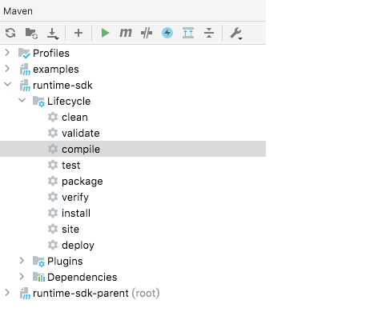

## How to use this sdk
### 1. import sdk
对于 Maven 项目，将以下配置添加进 `pom.xml` 文件:
```xml
<project>
  ...
  <dependencies>
    ...
    <dependency>
        <groupId>io.mosn.layotto</groupId>
        <artifactId>runtime-sdk-parent</artifactId>
        <version>1.0.0-SNAPSHOT</version>
    </dependency>
    ...
  </dependencies>
  ...
</project>
```

### 2. Run the examples
clone仓库到本地:

```sh
git clone https://github.com/mosn/layotto.git
```

构建并运行Layotto:

```bash
# make sure you replace this `${projectpath}` with your own project path.
cd ${projectpath}/cmd/layotto
go build
./layotto start -c ../../configs/config_redis.json
```

构建java-sdk [Maven](https://maven.apache.org/install.html) (Apache Maven version 3.x) 项目:

```sh
# make sure you replace this `${projectpath}` with your own project path.
cd ${projectpath}/sdk/java-sdk
mvn clean install
```

通过以下Examples示例来了解如何使用SDK:
* Hello world:  `${projectpath}/sdk/java-sdk/examples/src/main/java/io/mosn/layotto/examples/helloworld`
* State management:  `${projectpath}/sdk/java-sdk/examples/src/main/java/io/mosn/layotto/examples/state`
* Pubsub API:  `${projectpath}/sdk/java-sdk/examples/src/main/java/io/mosn/layotto/examples/pubsub`


## How to generate a Java PROTO file

### 1. 下载编译工具  [protoc](https://github.com/protocolbuffers/protobuf/releases)
my protoc version:
```shell
$ protoc --version
libprotoc 3.11.2
```

### 2. 修改对应`proto`文件生成类名包名等信息
(需先修改文件内部service名)
`spec/proto/runtime/v1/appcallback.proto` :
```protobuf
option java_outer_classname = "AppCallbackProto";
option java_package = "spec.proto.runtime.v1";
```
`spec/proto/runtime/v1/runtime.proto` :
```protobuf
option java_outer_classname = "RuntimeProto";
option java_package = "spec.proto.runtime.v1";
```

### 3. 编译其对应`JAVA`文件
```shell
cd ${your PROJECT path}/spec/proto/runtime/v1
protoc -I=. --java_out=./  runtime.proto
```

PS: 建议用maven插件`protoc-gen-grpc-java`生成protobuf和grpc的java代码

如果您在使用 [IntelliJ IDEA](https://www.jetbrains.com/help/idea/discover-intellij-idea.html) ,双击 Maven插件， IDE 会自动帮你编译 proto 文件:

