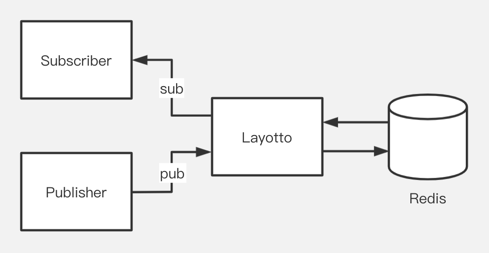

<h2>通过Layotto调用redis，进行消息发布/订阅</h2>

## 快速开始

该示例展示了如何通过Layotto调用redis，进行消息发布/订阅。

该示例的架构如下图，启动的进程有：redis、一个监听事件的Subscriber程序、Layotto、一个发布事件的Publisher程序


### 部署redis

1. 取最新版的 Redis 镜像。
这里我们拉取官方的最新版本的镜像：

```shell
docker pull redis:latest
```

2. 查看本地镜像
   使用以下命令来查看是否已安装了 redis：

```shell
docker images
```


3. 运行容器

安装完成后，我们可以使用以下命令来运行 redis 容器：

```shell
docker run -itd --name redis-test -p 6380:6379 redis
```

参数说明：

-p 6380:6379：映射容器服务的 6379 端口到宿主机的 6380 端口。外部可以直接通过宿主机ip:6380 访问到 Redis 的服务。

### 启动Subscriber程序,订阅事件
```bash
 cd ${projectpath}/demo/pubsub/redis/server/
 go build -o subscriber
 ./subscriber
```
打印出如下信息则代表启动成功：

```shell
Start listening on port 9999 ...... 

```

解释：

该程序会启动一个gRPC服务器，开放两个接口：

- ListTopicSubscriptions

调用该接口会返回应用订阅的Topic。本程序会返回"topic1"

- OnTopicEvent

当有新的事件发生时，Layotto会调用该接口，将新事件通知给Subscriber。

本程序接收到新事件后，会将事件打印到命令行。

### 运行Layotto

将项目代码下载到本地后，切换代码目录、编译：

```bash
cd ${projectpath}/cmd/layotto
go build
```

完成后目录下会生成layotto文件，运行它：

```bash
./layotto start -c ../../configs/config_apollo_health_mq.json
```

### 运行Publisher程序，调用Layotto发布事件

```bash
 cd ${projectpath}/demo/pubsub/redis/client/
 go build -o publisher
 ./publisher
```

打印出如下信息则代表调用成功：

```bash
Published a new event.Topic: topic1 ,Data: value1 
```

### 检查Subscriber收到的事件消息

回到subscriber的命令行，会看到接收到了新消息：
```shell
Start listening on port 9999 ...... 
Received a new event.Topic: topic1 , Data:value1 
```

### 下一步

示例Publisher程序中使用了Layotto提供的golang版本sdk，sdk位于`sdk`目录下，用户可以通过对应的sdk直接调用Layotto提供的服务。

除了使用sdk，您也可以用任何您喜欢的语言、通过grpc直接和Layotto交互
