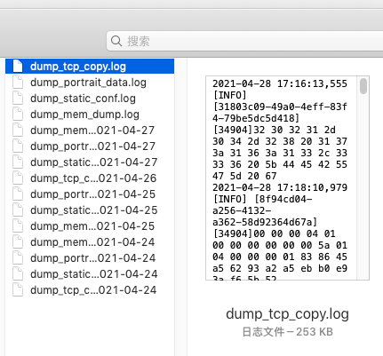

## Dump TCP流量

### 介绍

当您按照quick start文档[通过Layotto调用apollo配置中心](../configuration/start-apollo.md)运行demo时，可能会注意到配置文件config_apollo.json中有这么一段配置：

```json
                {
                  "type": "tcpcopy",
                  "config": {
                    "strategy": {
                      "switch": "ON",
                      "interval": 30,
                      "duration": 10,
                      "cpu_max_rate": 80,
                      "mem_max_rate": 80
                    }
                  }
```
这段配置的含义是启动时加载tcpcopy插件，进行tcp流量dump。

dump下来的二进制流量数据会存放在 ${user's home directory}/logs/mosn 目录，或/home/admin/logs/mosn 目录下:



您可以结合其他工具和基础设施使用这些数据，例如进行流量回放、旁路验证等。

### 配置项说明

上文的json中，strategy配置项主要用来进行采样策略配置，具体配置说明如下：

```go
type DumpConfig struct {
	Switch     string  `json:"switch"`       // dump switch.'ON' or 'OFF'
	Interval   int     `json:"interval"`     // dump sampling interval, unit: second
	Duration   int     `json:"duration"`     // Single sampling duration,unit: second
	CpuMaxRate float64 `json:"cpu_max_rate"` // cpu max rate.When cpu rate bigger than this threshold,dump function will be fused
	MemMaxRate float64 `json:"mem_max_rate"` // mem max rate.When memory rate bigger than this threshold,dump function will be fused
}
```

### 实现原理

Layotto服务器运行在MOSN上，使用MOSN的filter扩展能力，因此上文的tcpcopy其实是MOSN的一个network filter插件。

您可以参考 [MOSN 源码解析 - filter扩展机制](https://mosn.io/blog/code/mosn-filters/) 实现您自己的4层filter插件